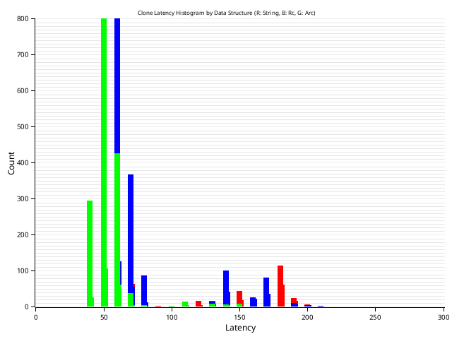

# Rust String Clone Performance Benchmark

Let's find out just how much Arc costs, and if there really is a major gain by utilizing Rc.

## Overview
Benchmark experiment comparing cloning performance of different string types in Rust.

## Experiment Configuration
- **Total Iterations:** 2048
- **String Sizes Tested:**
  - Small (32 characters)
  - Small-Medium (256 characters)
  - Medium (1024 characters)

## Methodology
1. Generate random alphanumeric strings
2. Measure cloning time in nanoseconds
3. Calculate performance metrics:
   - Mean clone time
   - Maximum clone time
   - Minimum clone time

## Tested String Types
- Standard `String`
- Reference Counted `Rc<str>`
- Atomic Reference Counted `Arc<str>`

## Outputs
- CSV files for each string size
- Performance histogram
- Console performance statistics

## Dependencies
- `rand` for random string generation
- Rust standard library smart pointers

## Running the Benchmark
```bash
    cargo run
```
## Results

Small:



